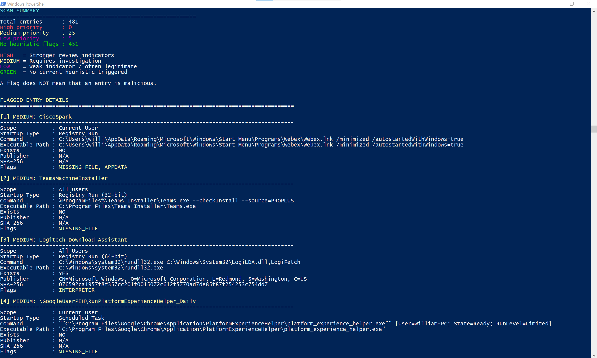

# Windows Persistence Scanner

A Python-based Windows security auditing and threat-hunting tool that identifies common Windows autostart and persistence mechanisms and analyzes them using **conservative risk-based heuristics**.

The scanner enumerates Startup folders, Registry Run keys, Scheduled Tasks, and automatic Windows Services while collecting information such as executable paths, Authenticode publishers, digital signature status, and SHA-256 hashes.

Rather than treating every unusual characteristic as malicious, the scanner uses a **weighted risk-scoring system** designed to reduce false positives and prioritize entries that deserve further investigation.

---

## Features

### Persistence Discovery

The scanner examines several common Windows persistence and autostart locations:

- Current User Startup Folder
- All Users Startup Folder
- HKCU `Run`
- HKCU `RunOnce`
- HKLM `Run`
- HKLM `RunOnce`
- 32-bit and 64-bit HKLM Registry views
- Scheduled Tasks with executable actions
- Automatic Windows Services

Each entry is labeled according to its scope:

- **Current User**
- **All Users**
- **System / All Users**

---

## Security Analysis

For discovered entries, the scanner can collect:

- Persistence entry name
- User/system scope
- Startup mechanism
- Original command
- Command arguments
- Launcher executable
- Explicit target or payload when confidently identifiable
- File existence
- Authenticode publisher
- Authenticode signature status
- SHA-256 hash
- Heuristic flags
- Risk score
- Severity

This makes the tool useful for:

- Windows security auditing
- Threat hunting
- Incident-response triage
- Persistence analysis
- Blue-team training
- Digital forensics
- Cybersecurity labs

---

## Conservative Risk Scoring

The scanner intentionally uses a conservative scoring model.

A flag does **not** mean that a file is malware.

Instead, flags represent characteristics that may be useful during an investigation. Weak characteristics receive small scores, while stronger behaviors receive significantly larger scores.

### Severity Levels

| Severity | Score | Meaning |
|---|---:|---|
| CLEAN | 0 | No configured heuristic flags triggered |
| LOW | 1–2 | Minor characteristics worth noting |
| MEDIUM | 3–5 | Entry warrants additional review |
| HIGH | 6+ | Strong or combined indicators warrant closer investigation |

`CLEAN` should not be interpreted as a guarantee that an entry is safe. It means only that the entry did not trigger the scanner's configured heuristics.

---

## Heuristic Flags

### Strong Indicators

These indicators contribute heavily to the risk score:

| Flag | Score | Description |
|---|---:|---|
| `TEMP_PATH` | +5 | Persistence executes from a temporary directory |
| `DOWNLOADS_PATH` | +5 | Persistence executes from the user's Downloads directory |
| `ENCODED_COMMAND` | +5 | PowerShell uses an encoded command |
| `HIDDEN_WINDOW` | +4 | PowerShell requests hidden-window execution |

### Moderate Indicators

| Flag | Score | Description |
|---|---:|---|
| `NETWORK_PATH` | +3 | Execution occurs from a UNC/network path |
| `SYSTEM_USER_WRITABLE` | +3 | System-level persistence points to a user-writable location |
| `MISSING_FILE` | +2 | An explicitly referenced path cannot be found |
| `MSHTA` | +2 | Persistence invokes `mshta.exe` |

### Weak Indicators

These are primarily contextual. They generally do not produce a high-priority result by themselves.

| Flag | Score |
|---|---:|
| `POWERSHELL` | +1 |
| `CMD` | +1 |
| `RUNDLL32` | +1 |
| `REGSVR32` | +1 |
| `WSCRIPT` | +1 |
| `CSCRIPT` | +1 |
| `SCRIPT` | +1 |
| `APPDATA` | +1 |
| `LOCAL_APPDATA` | +1 |
| `UNSIGNED` | +1 |

This distinction helps prevent legitimate Windows components from being unnecessarily classified as suspicious.

---

## False-Positive Reduction

Windows legitimately uses tools such as:

- `powershell.exe`
- `cmd.exe`
- `rundll32.exe`
- `regsvr32.exe`
- `wscript.exe`
- `cscript.exe`

The presence of one of these programs is therefore not sufficient evidence of malicious activity.

The scanner preserves these observations as weak indicators while emphasizing stronger combinations of behavior.

For example:

```text
RUNDLL32
Microsoft-signed DLL
System32 location

Score: 0–1
Result: CLEAN / LOW
```

A more unusual entry could produce:

```text
POWERSHELL       +1
SCRIPT           +1
APPDATA          +1
UNSIGNED         +1
--------------------
Risk Score        4

Severity: MEDIUM
```

A stronger combination could produce:

```text
POWERSHELL       +1
TEMP_PATH        +5
ENCODED_COMMAND  +5
HIDDEN_WINDOW    +4
SCRIPT           +1
UNSIGNED         +1
--------------------
Risk Score       17

Severity: HIGH
```

The purpose of the scoring system is to prioritize investigation—not make an automatic malware determination.

---

## Improved Command Parsing

Windows persistence commands are not always simple executable paths.

For example:

```text
"C:\Program Files\Example\Application.exe" --startup
```

or:

```text
C:\Windows\System32\rundll32.exe C:\Windows\System32\example.dll,EntryPoint
```

The scanner uses conservative command parsing to distinguish between:

- Launcher
- Arguments
- Explicit payload/target

It avoids assuming that every secondary argument is another executable.

This reduces false `MISSING_FILE` findings from commands such as:

```text
Update.exe --processStart "Application.exe"
```

---

## Payload Detection

The scanner attempts to identify explicit payload files for supported launchers.

Examples include:

### PowerShell

```text
powershell.exe -File C:\Scripts\startup.ps1
```

Launcher:

```text
powershell.exe
```

Target:

```text
C:\Scripts\startup.ps1
```

### Rundll32

```text
rundll32.exe C:\Windows\System32\example.dll,EntryPoint
```

Launcher:

```text
rundll32.exe
```

Target:

```text
C:\Windows\System32\example.dll
```

### Windows Script Host

```text
wscript.exe C:\Scripts\startup.vbs
```

Launcher:

```text
wscript.exe
```

Target:

```text
C:\Scripts\startup.vbs
```

Target extraction is intentionally conservative to reduce false positives.

---

## SHA-256 Hashing

When a referenced file exists, the scanner calculates its SHA-256 hash.

Example:

```text
Launcher SHA-256:
076592ca1957f8f357cc201f0015072c612f5770ad7de85f87f254253c754dd7
```

When an explicit payload can be identified, the scanner can hash both the launcher and target.

For example:

```text
Launcher:
C:\Windows\System32\rundll32.exe

Launcher SHA-256:
<hash>

Target:
C:\Windows\System32\example.dll

Target SHA-256:
<hash>
```

Hash results are cached during the scan so identical files do not need to be repeatedly hashed.

---

## Authenticode Analysis

The scanner uses Windows PowerShell to retrieve Authenticode information for files.

Information can include:

```text
Publisher:
CN=Microsoft Windows, O=Microsoft Corporation...

Signature:
Valid
```

Unsigned files may appear as:

```text
Publisher:
Unsigned

Signature:
NotSigned
```

An unsigned file is **not automatically malicious**.

Unsigned status contributes only a small amount to the risk score.

---

## Scheduled Tasks

The scanner enumerates Windows Scheduled Tasks and examines tasks containing executable actions.

For each applicable task, it can analyze:

- Task name
- Task path
- User/system scope
- Executable
- Arguments
- Launcher
- Explicit target
- Publisher
- Signature
- SHA-256
- Risk indicators

Tasks without executable actions are not converted into fake executable paths.

This prevents task metadata from being incorrectly classified as a missing launcher.

---

## Windows Services

The scanner examines **automatic Windows Services**.

Manual-start services are intentionally excluded from the primary persistence scan to reduce noise.

For applicable services, the scanner analyzes the configured executable path and applies the same hashing, publisher, signature, and heuristic analysis used elsewhere.

---

## Example Scan Summary

```text
SCAN SUMMARY
============================================================

Total entries      : 204
High priority      : 0
Medium priority    : 1
Low priority       : 7
No heuristic flags : 196
```

This does **not** mean that 204 threats were discovered.

It means that 204 persistence/autostart entries were enumerated.

In this example:

```text
196 -> No configured heuristic flags
7   -> Minor indicators
1   -> Recommended for additional review
0   -> Reached the HIGH threshold
```

The scanner therefore reduces a large collection of Windows autostart activity into a smaller group of entries for manual investigation.

---

## Example Detailed Finding

```text
[1] MEDIUM (Score 4) - ExampleTask
----------------------------------------------------------------------------------------------------

Scope              : Current User
Startup Type       : Scheduled Task
Command            : powershell.exe -File C:\Users\User\AppData\Roaming\startup.ps1

Launcher           : C:\Windows\System32\WindowsPowerShell\v1.0\powershell.exe
Launcher Exists    : YES
Launcher Publisher : Microsoft Corporation
Launcher Signature : Valid
Launcher SHA-256   : <SHA-256>

Target             : C:\Users\User\AppData\Roaming\startup.ps1
Target Exists      : YES
Target Publisher   : Unsigned
Target Signature   : NotSigned
Target SHA-256     : <SHA-256>

Risk Score         : 4
Flags              : POWERSHELL, SCRIPT, APPDATA, UNSIGNED
```

This is a review candidate, not an automatic malware verdict.

---

## Requirements

- Windows 10 or Windows 11
- Python 3.x
- Windows PowerShell
- Administrator privileges recommended

The scanner uses Python's standard library and does not require third-party Python packages.

---

## Usage

Clone the repository:

```bash
git clone https://github.com/YOUR-USERNAME/windows-persistence-scanner.git
```

Enter the project directory:

```bash
cd windows-persistence-scanner
```

Run the scanner:

```bash
python windows_persistence_scanner.py
```

On systems where Python is accessed through the Python launcher:

```bash
py windows_persistence_scanner.py
```

For the most complete results, run the terminal as **Administrator**.

---

## Repository Structure

```text
windows-persistence-scanner/
│
├── windows_persistence_scanner.py
├── README.md
├── LICENSE
│
└── screenshots/
    └── windows-persistence-scanner-results.png
```

---

## Screenshot



---

## Current User vs All Users

The scanner distinguishes persistence scope.

### Current User

Examples include:

```text
HKCU\Software\Microsoft\Windows\CurrentVersion\Run
```

and:

```text
%APPDATA%\Microsoft\Windows\Start Menu\Programs\Startup
```

These normally apply to the currently logged-in user.

### All Users / System

Examples include:

```text
HKLM\Software\Microsoft\Windows\CurrentVersion\Run
```

automatic Windows Services, system Scheduled Tasks, and:

```text
%PROGRAMDATA%\Microsoft\Windows\Start Menu\Programs\StartUp
```

These can affect the entire system or multiple users.

---

## Read-Only Design

Windows Persistence Scanner is designed as an **auditing and analysis tool**.

It does not:

- Delete Registry entries
- Delete Scheduled Tasks
- Stop Services
- Remove Startup applications
- Quarantine files
- Modify executable files
- Automatically classify a program as malware

Remediation decisions remain with the analyst.

---

## Limitations

This project is not a replacement for an EDR, antivirus platform, SIEM, or professional incident-response toolkit.

The scanner currently focuses on selected common persistence mechanisms.

Not every Windows persistence technique is covered.

Potential limitations include:

- Some executable paths may not resolve correctly
- Some Scheduled Task action types may not contain executable paths
- Some services use `svchost.exe`, where the actual service implementation resides in a separate DLL
- Publisher information depends on Windows Authenticode
- Legitimate applications may be unsigned
- Signed files can still potentially be abused
- Heuristic scoring cannot determine intent
- File hashes do not independently determine whether a file is malicious
- `CLEAN` means no configured heuristic matched, not guaranteed safe

---

## Future Improvements

Potential future additions include:

- Service DLL resolution for `svchost.exe`
- Scheduled Task trigger analysis
- Boot-trigger and logon-trigger identification
- Winlogon persistence
- Shell persistence
- AppInit DLL analysis
- Image File Execution Options
- WMI permanent event subscriptions
- Startup Approved Registry analysis
- Registry policy startup mechanisms
- Explorer/Shell extension analysis
- File creation/modification timestamps
- PE metadata analysis
- Parent directory permission analysis
- Improved Microsoft signature validation
- Duplicate hash identification
- JSON export
- CSV export
- VirusTotal hash lookup
- MITRE ATT&CK technique mapping
- Configurable risk thresholds
- Allowlist support

---

## MITRE ATT&CK Relevance

Several persistence mechanisms examined by this project relate to Windows techniques documented by the MITRE ATT&CK framework, including areas such as:

- Boot or Logon Autostart Execution
- Registry Run Keys / Startup Folder
- Scheduled Task/Job
- Windows Service

Future versions may map individual findings directly to applicable ATT&CK technique identifiers.

---

## Intended Use

This project was created for:

- Cybersecurity education
- Defensive security
- Threat hunting
- Windows security auditing
- Incident-response training
- Digital-forensics practice
- Blue-team labs
- Portfolio development

Use the scanner only on systems you own or are authorized to analyze.

---

## Disclaimer

Windows Persistence Scanner is provided for educational and defensive security purposes.

The heuristic scoring system is intended to assist analysts with prioritization. A HIGH, MEDIUM, or LOW result is **not proof that a file or persistence mechanism is malicious**, and a CLEAN result is **not proof that an entry is safe**.

Always validate findings using additional evidence before taking remediation action.

---

## License

This project is intended to be distributed under the MIT License. See `LICENSE` for details.
